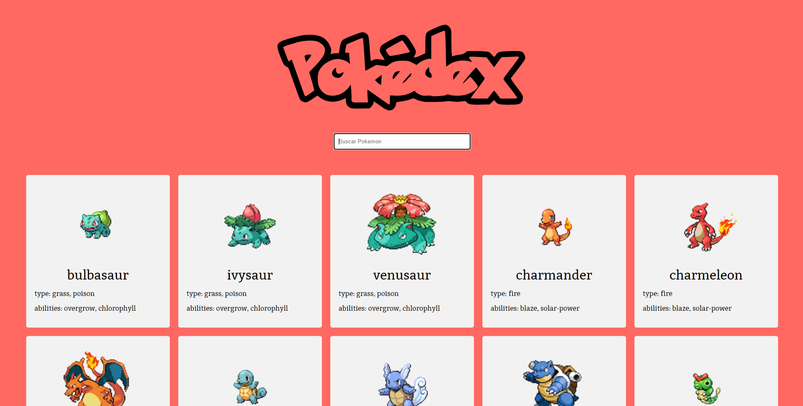

# Pokedex
> Projeto com intuito de desenvolver uma pokedex.

A aplicação foi desenvolvida em JavaScript(VanillaJS) e consumindo os dados de uma API REST chamado PokéAPI(https://pokeapi.co/). 

## Frameworks

    Axios(https://github.com/axios/axios)

